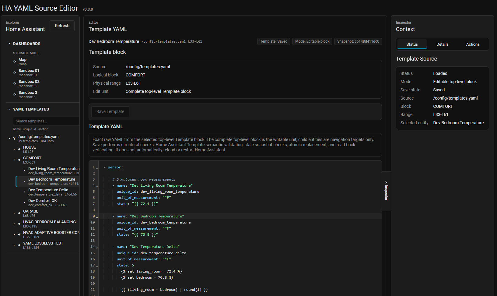
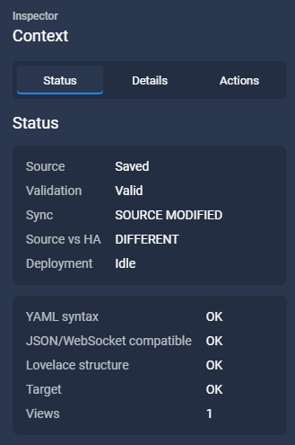
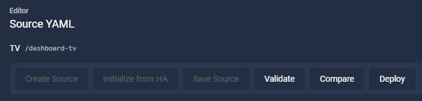

# HA YAML Source Editor


**Keep your YAML. Keep your comments. Keep the Home Assistant UI.**

HA YAML Source Editor is a Home Assistant custom integration for people who want to
maintain hand-authored Lovelace YAML without giving up Home Assistant's normal UI
and supported dashboard APIs.

Home Assistant stores Lovelace dashboards as structured configuration. When YAML is
parsed and later serialized again, comments, blank lines, quoting choices, and manual
organization can disappear. HA YAML Source Editor keeps a separate raw **Source YAML**
document as the editable source of truth and deploys validated configuration through
Home Assistant's supported Lovelace WebSocket API.

**Current release: v0.2.1**



## Why This Exists

Home Assistant is very good at managing configuration as structured data. That is also
why it cannot reliably preserve every detail of hand-authored YAML.

A configuration can remain semantically identical while losing things that matter to a
human editor:

- comments;
- blank lines;
- quoting choices;
- indentation and visual grouping;
- manual ordering and organization.

HA YAML Source Editor separates those concerns.

**Source YAML is the source of truth.**

The integration stores the Source as raw text. Normal Source workflows never regenerate
that YAML from parsed configuration and never automatically format, normalize, trim,
reorder, or parse-and-dump it.

When you deploy, the saved Source is validated and converted only for the purpose of
sending configuration to Home Assistant. Your Source document remains yours.

## Workspace

v0.2.0 introduces a persistent application workspace built around:

`Explorer | Editor | Inspector`

The intention is not to clone VS Code. The goal is to make the YAML editor the center of
the experience while keeping Home Assistant styling and behavior.

### Explorer

The Explorer provides quick navigation between supported persisted Storage Mode
Lovelace dashboards without leaving the editor workspace.

Additional Explorer improvements are still planned; the current implementation focuses
on dashboard selection and navigation.

### Editor

The central Source editor uses CodeMirror 6 and remains the primary workspace.

Editor features include:

- YAML syntax highlighting;
- line numbers;
- YAML block folding;
- indentation guides;
- active-line highlighting;
- search and replace with `Ctrl+F`;
- Tab / Shift+Tab indentation;
- undo and redo with isolated history between Source Documents;
- editor status information including line, column, line count, YAML mode, LF mode,
  and Saved/Modified state.

These are editing conveniences only. The editor does **not** automatically rewrite your
Source YAML.

### Inspector

The Inspector provides contextual information and actions for the selected Source,
including:

- Source state;
- synchronization state;
- validation;
- semantic comparison;
- deployment baseline information;
- deployment status;
- conflict resolution.

On wide layouts the Inspector opens by default. On narrower layouts it defaults closed
and can be opened with the vertical Inspector control. After you manually toggle it, the
responsive layout does not override that choice during normal updates.



## Workflow

The normal Source workflow is:

`Create / Initialize → Edit → Save Source → Validate → Compare → Deploy`



### Create Source

Use **Create Source** when the selected supported dashboard does not yet have a Source
Document.

This creates the Source Document only. It does not deploy anything to Home Assistant.

### Initialize from HA

Use **Initialize from HA** when a Source Document already exists but its saved Source is
genuinely empty.

Initialization:

- performs a fresh read of the current Home Assistant dashboard configuration;
- converts Home Assistant's normalized configuration into Source YAML;
- saves that YAML into the existing Source Document;
- does **not** deploy;
- does **not** modify Home Assistant;
- uses the existing HA-import semantic verification path before persistence.

Initialization is intentionally an adoption workflow for an empty Source Document.

A Source containing comments or any other non-whitespace text is not considered empty.

Home Assistant cannot return comments, blank lines, quoting, or formatting that it has
already discarded. Therefore initialization can reproduce the current dashboard
semantics, but it cannot reconstruct the original hand-authored YAML presentation.

### Edit and Save Source

Edit the Source directly in the CodeMirror editor.

**Save Source** persists the raw Source text. Saving does not deploy it to Home Assistant.

### Validate

Validation checks the saved Source for:

- YAML syntax;
- JSON/WebSocket-compatible values;
- basic Lovelace structure;
- selected target availability.

Custom cards are intentionally tolerated. HA YAML Source Editor does not attempt to
validate every custom card's private schema.

### Compare

Compare is semantic.

It compares parsed **saved Source** configuration with the current normalized Home
Assistant configuration. Comments, whitespace, quoting, and formatting are not part of
semantic comparison.

When a semantic baseline snapshot is available, the application can show three-way
analysis:

- changes in Saved Source since baseline;
- changes in Home Assistant since baseline;
- current Saved Source vs Home Assistant difference.

Older baselines without a snapshot fall back to current two-way comparison.

Arrays are compared by index. Reordering views or cards may therefore appear as multiple
indexed changes instead of a single move.

### Deploy

Deployment uses **saved Source only**, never unsaved editor text.

Before writing, HA YAML Source Editor validates Source, rechecks the target dashboard,
performs conflict/preflight checks, and asks for confirmation where appropriate.

The write is performed through Home Assistant's native Lovelace WebSocket API. The
result is then read back and verified. A new synchronization baseline is recorded only
after successful verification.

Home Assistant's Lovelace save API does not provide compare-and-swap or ETag locking.

HA YAML Source Editor uses optimistic pre-save rechecks to narrow the race window, but
does not claim atomic locking of Home Assistant's dashboard state.

## Features

- Admin-only Home Assistant sidebar panel.
- Discovery of existing persisted Storage Mode Lovelace dashboards.
- Explorer | Editor | Inspector workspace.
- Professional CodeMirror 6 Source editor.
- One Source Document per supported dashboard.
- `Create Source` workflow.
- `Initialize from HA` for existing empty Source Documents.
- Raw/lossless Source YAML persistence using Home Assistant Store.
- Explicit `Save Source`.
- YAML and target validation.
- Source text hash, Source semantic hash, and current Home Assistant semantic hash.
- Synchronization states for not deployed, in sync, Source modified, HA modified,
  both modified, and sync errors.
- Semantic Compare.
- Legacy two-way comparison for older baselines.
- Snapshot-backed three-way analysis for newer baselines.
- Safe verified deployment of saved Source YAML.
- Persistent synchronization baselines after verified deployment or explicit HA import.
- Explicit conflict resolution.
- Responsive Inspector.
- Local vendored CodeMirror and js-yaml runtime dependencies.
- No direct `.storage` file writes.

## Supported Targets

Currently supported:

- Existing persisted **Storage Mode Lovelace dashboards** returned by
  `lovelace/dashboards/list`.

Currently not supported:

- Auto-generated default Overview dashboards with no persisted Lovelace configuration.
- YAML-mode dashboards.
- Automations.
- Scripts.
- Scenes.
- Individual views or cards as independent Source targets.
- Creating or deleting dashboards.

Support for additional Home Assistant Source targets is planned separately from the
current dashboard workflow.

## Installation

### HACS Custom Repository — Recommended

HA YAML Source Editor can be installed through HACS as a **Custom Repository**.

The integration is not currently assumed to be part of the default HACS catalog, so add
the repository manually the first time.

#### 1. Add the repository to HACS

Open **HACS** in Home Assistant.

Open the **three-dot menu (⋮)** in the upper-right corner and choose:

**Custom repositories**

Add:

- **Repository:** `https://github.com/Renbrant/home-assistant-yaml-source-editor`
- **Type:** `Integration`

Then click **ADD**.

#### 2. Download HA YAML Source Editor

After adding the repository:

1. Search HACS for **HA YAML Source Editor**.
2. Open the integration.
3. Click **Download**.
4. Select the latest version if HACS asks which release to install.
5. Wait for HACS to finish.

HACS installs the integration under Home Assistant's `custom_components` directory.

#### 3. Restart Home Assistant

Restart Home Assistant after installation:

**Settings → System → Restart Home Assistant**

A restart is required because HA YAML Source Editor includes a Python custom integration.

#### 4. Add the integration

After Home Assistant restarts:

1. Go to **Settings → Devices & services**.
2. Click **Add integration**.
3. Search for **HA YAML Source Editor**.
4. Select it and complete setup.

If the integration does not appear immediately, hard-refresh the browser (`Ctrl+F5`)
and try again.

#### 5. Open HA YAML Source Editor

After setup, **HA YAML Source Editor** appears in the Home Assistant sidebar for
administrator users.

Open it and select a supported Storage Mode dashboard.

### Manual Installation

HACS is recommended, but manual installation is also possible.

Download or clone this repository and copy:

```text
custom_components/ha_yaml_source_editor
```

into:

```text
<config>/custom_components/
```

The resulting structure should look similar to:

```text
<config>/
└── custom_components/
    └── ha_yaml_source_editor/
        ├── __init__.py
        ├── manifest.json
        ├── config_flow.py
        └── ...
```

Restart Home Assistant, then go to:

**Settings → Devices & services → Add integration**

Search for **HA YAML Source Editor** and complete setup.

## Your First Source Document

There are two common onboarding paths.

### Path A — Start with your own YAML

1. Open **HA YAML Source Editor**.
2. Select a supported Storage Mode dashboard.
3. Click **Create Source**.
4. Enter or paste the YAML you want to maintain.
5. Click **Save Source**.
6. Click **Validate**.
7. Run **Compare**.
8. **Deploy** when you are ready.

This is the best path when you already have the hand-authored YAML you want to preserve.

### Path B — Adopt an existing Home Assistant dashboard

1. Open **HA YAML Source Editor**.
2. Select the existing Storage Mode dashboard.
3. Create its Source Document if necessary.
4. With the Source still empty, click **Initialize from HA**.
5. Review the generated Source YAML.
6. Continue with **Save Source → Validate → Compare → Deploy** as you edit it later.

`Initialize from HA` does not deploy or change Home Assistant. It only establishes the
Source from Home Assistant's current normalized dashboard configuration.

The process is necessarily lossy with respect to comments and presentation that Home
Assistant has already removed.

## Synchronization States

`NOT DEPLOYED`
The Source Document has no synchronization baseline.

`IN SYNC`
Saved Source semantics match the current Home Assistant dashboard and the baseline.

`SOURCE MODIFIED`
Saved Source changed since the baseline while Home Assistant still matches it.

`HA MODIFIED`
Home Assistant changed since the baseline while saved Source still matches it.

`BOTH MODIFIED`
Saved Source and Home Assistant both changed since the baseline.

`SYNC ERROR`
Synchronization status could not be calculated.

`Source vs HA` is a separate direct comparison between current saved Source semantics
and the current Home Assistant configuration. It reports `MATCH`, `DIFFERENT`, or
`UNAVAILABLE`.

## Baselines

Synchronization baselines can have different origins.

### Deployment

A deployment baseline is established only after HA YAML Source Editor successfully
writes the saved Source to Home Assistant and verifies the resulting configuration.

For this origin, the Inspector can truthfully report deployment information such as
**Last deployed**.

### Imported from Home Assistant

A Home Assistant import/initialization baseline represents configuration adopted from
Home Assistant.

It is **not** a deployment event and should not be interpreted as "Last deployed".

This distinction is intentional in the v0.2.0 interface.

## Conflict Resolution

Conflict-resolution actions are separate from empty-Source initialization.

### Import HA Version

**Import HA Version** is an explicit conflict-resolution action that chooses the current
Home Assistant dashboard configuration as the new Source.

This is lossy with respect to Source presentation. It may replace comments, blank lines,
quoting, formatting, and manual YAML organization.

It does not modify Home Assistant.

Before saving, generated YAML is parsed and compared semantically with the Home Assistant
configuration. If the round trip changes semantics, the import is blocked.

### Overwrite HA with Saved Source

**Overwrite HA with Saved Source** chooses the saved Source as authoritative and replaces
the exact Home Assistant dashboard configuration reviewed by Compare.

It requires a fresh Compare snapshot and is only available for appropriate Home Assistant
conflict states.

If Source or Home Assistant changes after Compare, overwrite is blocked and Compare must
be run again.

## Data and Storage

Source Documents are stored using Home Assistant Store.

The integration does not write directly to `.storage` files.

Source YAML and dashboard configuration can contain sensitive information. Do not include
raw Source, Home Assistant configuration, or semantic diff values in bug reports unless
you intentionally sanitize them first.

Internal Store filenames and structure are implementation details, not an editing
interface.

Removing or updating the integration code does not intentionally delete Source Documents
stored by Home Assistant.

## Security

- Sidebar panel requires an administrator user.
- Custom WebSocket commands are admin-only.
- Runtime frontend assets are local to the custom integration.
- No CDN or runtime internet dependency is used by the editor.
- Source YAML, Home Assistant configuration, canonical snapshots, and diff values are
  not logged by the integration.
- Dashboard writes are performed through Home Assistant's supported Lovelace WebSocket
  API.
- No direct `.storage` writes are used for Lovelace deployment.

## Known Limitations

- Currently supports persisted Storage Mode Lovelace dashboards only.
- The Source editor uses LF as its canonical newline representation.
- HA import and initialization cannot recover comments or formatting already removed by
  Home Assistant.
- There is no automatic merge.
- There is no rollback or deployment history.
- Array diffs are index based.
- Home Assistant frontend-facing Lovelace APIs may change in future releases.
- Tested against Home Assistant Core 2026.8.1 and Home Assistant Frontend 20260729.6.
  Earlier or later versions may require compatibility updates.

## Troubleshooting

- After frontend updates, clear the browser cache or use `Ctrl+F5`.
- After Python integration updates, restart Home Assistant.
- Make sure you are using an administrator user.
- Check Home Assistant logs for integration setup errors.
- For HACS or manual installation, verify the folder is installed at
  `<config>/custom_components/ha_yaml_source_editor`.
- If the integration does not appear in **Add integration**, restart Home Assistant and
  clear the browser cache.

## License

MIT