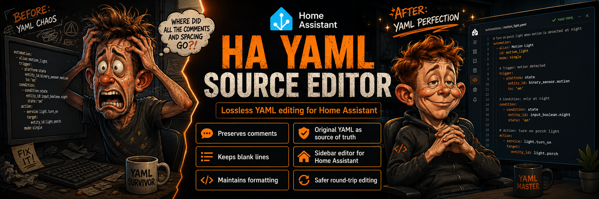

# HA YAML Source Editor



**Keep your YAML. Keep the Home Assistant UI.**

HA YAML Source Editor is a Home Assistant custom integration for people who
prefer hand-authored Lovelace YAML but still want to use Home Assistant's
supported frontend APIs.

## Why This Exists

Home Assistant's UI stores Lovelace dashboards as structured configuration. When
YAML is imported into that model and later serialized again, comments, blank
lines, quoting choices, and manual organization can be lost.

HA YAML Source Editor keeps a separate raw Source YAML document for each
supported dashboard. The Source YAML remains the editable source of truth, while
validated parsed configuration is deployed through Home Assistant's native
Lovelace WebSocket API.

## Core Principle

**Source YAML is the source of truth.**

Normal workflows never regenerate Source YAML from parsed data. The explicit
`Import HA Version` action is the one documented lossy exception: it converts
Home Assistant's current normalized dashboard configuration into new Source YAML
only after user confirmation and semantic round-trip verification.

## Features

- Admin-only Home Assistant sidebar panel.
- Discovery of persisted Storage Mode Lovelace dashboards.
- Read-only display of current Home Assistant dashboard configuration.
- One Source Document per supported dashboard.
- Raw Source YAML persistence using Home Assistant Store.
- Explicit `Save Source` action.
- Source YAML validation for syntax, JSON/WebSocket compatibility, basic
  Lovelace structure, and target availability.
- Source text hash, Source semantic hash, and current Home Assistant semantic
  hash.
- Synchronization states for not deployed, in sync, source modified, HA
  modified, both modified, and sync errors.
- Safe verified deployment of saved Source YAML.
- Persistent synchronization baseline after verified deployment or explicit HA
  import.
- Semantic compare between saved Source and current Home Assistant.
- Legacy two-way compare for baselines created before semantic snapshots.
- Snapshot-backed three-way analysis for newer baselines.
- Explicit conflict resolution:
  - `Import HA Version`, which is lossy and does not modify Home Assistant.
  - `Overwrite HA with Saved Source`, gated by a fresh Compare snapshot.
- No direct `.storage` file writes.

## Supported Targets in v0.1

Supported:

- Existing persisted Storage Mode Lovelace dashboards returned by
  `lovelace/dashboards/list`.

Not supported in v0.1:

- Auto-generated default Overview dashboards with no persisted Lovelace config.
- YAML-mode dashboards.
- Automations.
- Scripts.
- Individual view or card targets.
- Creating or deleting dashboards.

## Installation

### HACS Custom Repository — Recommended

HA YAML Source Editor is available through HACS as a **Custom Repository**.

The integration is not yet included in the default HACS catalog, so the
repository must be added manually the first time.

#### 1. Add the repository to HACS

Open **HACS** in Home Assistant.

Click the **three-dot menu (⋮)** in the upper-right corner and select:

**Custom repositories**

Enter the following information:

- **Repository:** `https://github.com/Renbrant/home-assistant-yaml-source-editor`
- **Type:** `Integration`

Then click **ADD**.

#### 2. Download HA YAML Source Editor

After adding the repository:

1. Search HACS for **HA YAML Source Editor**.
2. Open the integration.
3. Click **Download**.
4. Select the latest version if HACS asks which version to install.
5. Wait for HACS to finish installing the integration.

HACS installs the integration under Home Assistant's `custom_components`
directory.

#### 3. Restart Home Assistant

After the download finishes, restart Home Assistant.

Go to:

**Settings → System → Restart Home Assistant**

A restart is required because HA YAML Source Editor contains a Python custom
integration.

#### 4. Add the integration

After Home Assistant restarts:

1. Go to **Settings → Devices & services**.
2. Click **Add integration**.
3. Search for **HA YAML Source Editor**.
4. Select it and complete the setup.

If the integration does not appear immediately, perform a hard refresh of the
browser (`Ctrl+F5`) and try again.

#### 5. Open HA YAML Source Editor

After setup, **HA YAML Source Editor** will appear in the Home Assistant sidebar
for administrator users.

Open it, select a supported Storage Mode dashboard, and create your first Source
Document.

### Manual Installation

HACS is the recommended installation method, but manual installation is also
possible.

Download or clone this repository and copy:

```text
custom_components/ha_yaml_source_editor
```

into:

```text
<config>/custom_components/
```

The resulting structure should look similar to:

```text
<config>/
└── custom_components/
    └── ha_yaml_source_editor/
        ├── __init__.py
        ├── manifest.json
        ├── config_flow.py
        └── ...
```

Restart Home Assistant.

Then go to:

**Settings → Devices & services → Add integration**

Search for:

```text
HA YAML Source Editor
```

and complete the setup.

## First Source Document

1. Open the `HA YAML Source Editor` sidebar panel.
2. Select an existing persisted Storage Mode dashboard.
3. Create a Source Document.
4. Paste or write Source YAML for that dashboard.
5. Click `Save Source`.
6. Click `Validate`.
7. Use Compare and Deploy when you are ready.

Do not start by pasting normalized Home Assistant JSON into the Source field.
Source Documents are intended for YAML you want to maintain directly.

If you already have a dashboard built in Home Assistant and want to adopt its
current configuration, use `Compare Source vs HA` followed by the explicit
`Import HA Version` action.

That path is intentionally lossy: comments, formatting, and manual YAML
organization that Home Assistant does not know about cannot be recovered.

## Validation

Validation checks:

- YAML syntax using the vendored js-yaml runtime.
- JSON/WebSocket-compatible values.
- Basic Lovelace structure.
- Selected target still exists and is Storage Mode.

Custom cards are intentionally tolerated. The editor does not try to validate
every custom card's private schema.

## Synchronization States

`NOT DEPLOYED`: The Source Document has no synchronization baseline.

`IN SYNC`: Saved Source semantics match the current Home Assistant dashboard and
the baseline.

`SOURCE MODIFIED`: Saved Source changed since the last baseline while Home
Assistant still matches that baseline.

`HA MODIFIED`: Home Assistant changed since the last baseline while saved Source
still matches that baseline.

`BOTH MODIFIED`: Saved Source and Home Assistant both changed since the last
baseline.

`SYNC ERROR`: Synchronization status could not be calculated.

`Source vs HA` is separate: it compares current saved Source semantics with the
current Home Assistant configuration and reports `MATCH`, `DIFFERENT`, or
`UNAVAILABLE`.

## Safe Deployment

Deployment uses saved Source only, never unsaved editor text.

The deployment flow validates Source YAML, rechecks the target dashboard, checks
for Home Assistant conflicts, asks for confirmation, writes through Home
Assistant's native `lovelace/config/save` WebSocket command, verifies the
result, and records a baseline only after verification succeeds.

The Home Assistant Lovelace save API does not provide compare-and-swap or ETag
locking.

HA YAML Source Editor uses optimistic pre-save rechecks to narrow the race
window, but it cannot claim atomic locking of Home Assistant's dashboard state.

## Compare

Compare is semantic.

It compares parsed saved Source configuration with the current normalized Home
Assistant configuration. It does not line-diff Source YAML against Home
Assistant JSON.

Comments, whitespace, quoting, and formatting are not part of semantic compare.

Arrays are compared by index. If views or cards are reordered, the comparison
may show multiple indexed changes instead of recognizing a move.

## Conflict Resolution

### Import HA Version

`Import HA Version` chooses the current Home Assistant dashboard configuration
as the new Source.

This is explicitly lossy.

It may replace comments, blank lines, quoting, formatting, and manual YAML
organization. It does not modify Home Assistant.

Before saving, the generated YAML is parsed and compared semantically with the
Home Assistant configuration.

If the round trip changes semantics, the import is blocked.

### Overwrite HA with Saved Source

`Overwrite HA with Saved Source` chooses the saved Source as authoritative and
replaces the exact Home Assistant dashboard configuration that was reviewed in
Compare.

It requires a fresh Compare snapshot and is only available for HA conflict
states.

If Source or Home Assistant changes after Compare, the overwrite is blocked and
Compare must be run again.

## Data and Storage

Source Documents are stored using Home Assistant Store.

The integration does not write directly to `.storage` files.

Source YAML and dashboard configuration can contain sensitive information.

Do not include raw Source, Home Assistant configuration, or semantic diff values
in bug reports unless you intentionally sanitize them first.

Internal Store filenames and structure are implementation details, not an
editing interface.

Removing or updating the integration code does not intentionally delete Source
Documents stored by Home Assistant.

## Security

- Sidebar panel requires an admin user.
- Custom WebSocket commands are admin-only.
- Runtime frontend assets are local to the custom integration.
- No CDN or internet runtime dependency is used.
- Source YAML, Home Assistant config, canonical snapshots, and diff values are
  not logged by the integration.
- Dashboard writes are performed through Home Assistant's supported Lovelace
  WebSocket API.

## Known Limitations

- v0.1 supports persisted Storage Mode Lovelace dashboards only.
- The browser textarea uses LF as the canonical editor newline representation.
- HA Import is lossy.
- There is no automatic merge.
- There is no rollback or deployment history.
- Array diffs are index based.
- Home Assistant frontend-facing Lovelace APIs may change in future releases.
- Tested against Home Assistant Core 2026.8.1 and Home Assistant Frontend
  20260729.6. Earlier or later versions may require compatibility updates.

## Troubleshooting

- After frontend updates, clear the browser cache or use `Ctrl+F5`.
- After Python integration updates, restart Home Assistant.
- Make sure you are using an administrator user.
- Check Home Assistant logs for integration setup errors.
- For HACS or manual installation, verify the folder is installed at
  `<config>/custom_components/ha_yaml_source_editor`.
- If the integration does not appear in **Add integration**, restart Home
  Assistant and clear the browser cache.


## License

MIT
